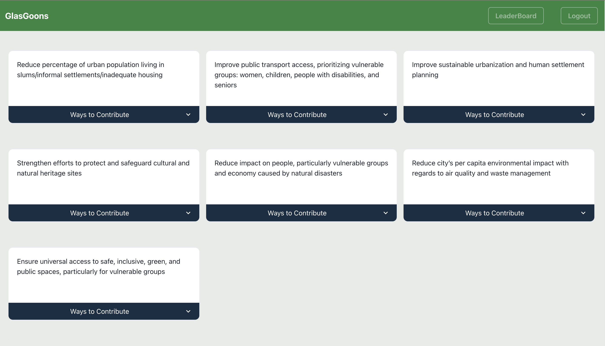
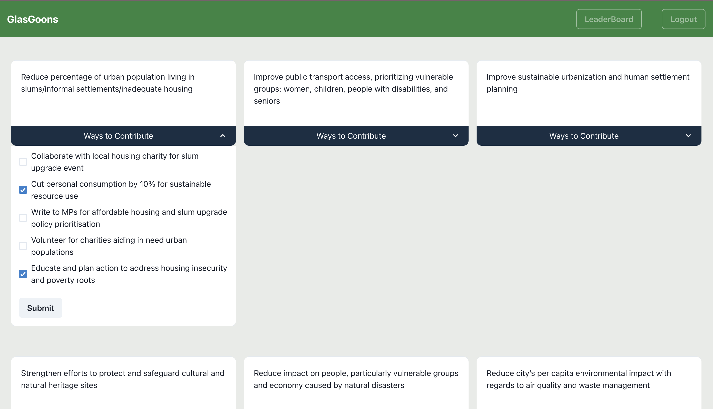
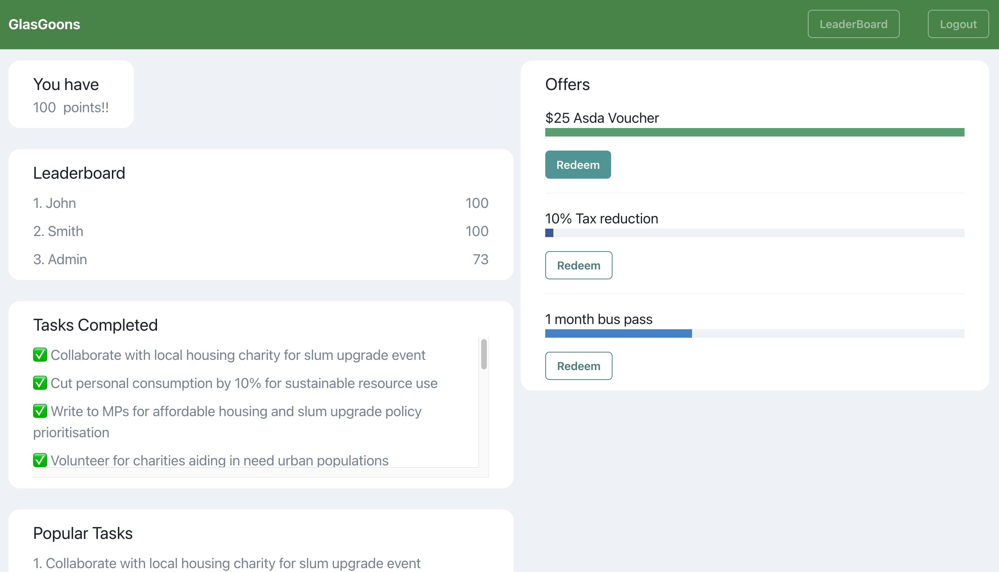

<h1>GlasGoons</h1>
<h3>Empowering Progress, One Achievable Goal at a Time</h3>

<i>Winner project during the CodeForGood 23 Hackathon conducted by J.P Morgan at Glasgow.</i>

<h4>What is GlasGoons?</h4>

An innovative platform designed to facilitate the realization of UN Sustainable Development Goals (SDGs) by breaking down these ambitious global objectives into smaller, attainable milestones.

<h4>How does it work?</h4>

This platform serves as a guiding framework for individuals, organizations, and communities seeking to actively contribute to the achievement of SDGs. It empowers users to navigate the complex landscape of sustainability by breaking down the larger, often daunting goals into manageable, actionable steps.

<h4>What are the benefits?</h4>

By dividing these lofty aspirations into smaller, achievable objectives, the platform empowers users to make tangible progress towards sustainable development. It provides a structured and user-friendly approach to addressing critical global challenges, ensuring that everyone, regardless of their background or expertise, can play a part in building a more sustainable future

<h4>Impact on social good?</h4>

In essence, this platform serves as a catalyst for meaningful change, bridging the gap between intention and action, and helping individuals and groups worldwide make tangible contributions to the UN's Sustainable Development Goals. It embodies the principle that every small step taken collectively leads to significant progress in addressing some of the most pressing global challenges of our time

DashBoard

    

Goals

    

LeaderBoard

    

<h4>Technologies</h4>
<ul>
    <li>React</li>
    <li>Chakra UI</li>
    <li>Hasura</li>
    <li>GraphQL</li>
    <li>REST API's</li>
</ul>
